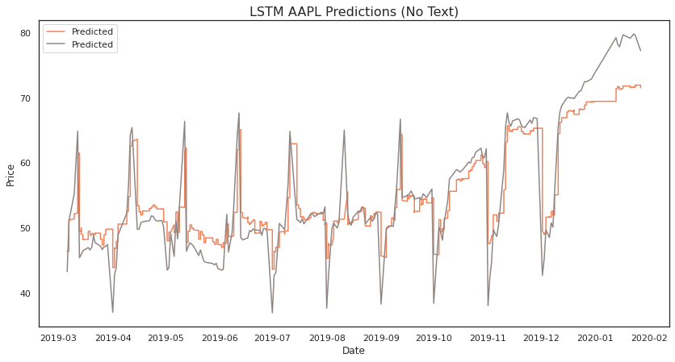
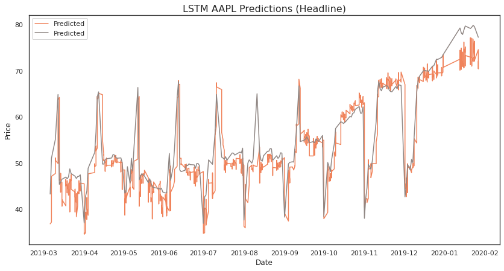
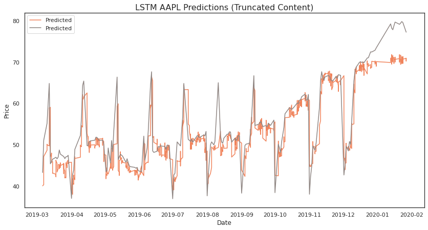
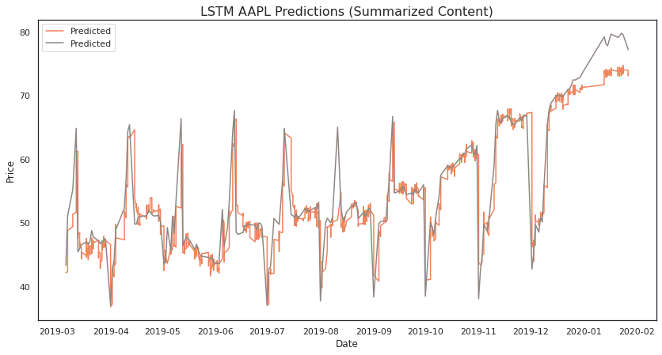
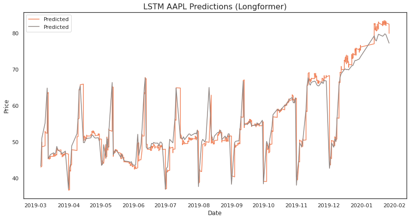

# Motivation
I began this project because I wanted to learn more about modeling financial markets. My experience is mostly in natural language processing (NLP), so I chose to start with the classic task of predicting stock movements with news data. Though many projects in this area focus on sentiment analysis, I was interested in using the content of the news itself, so I experimented with a few different text embedding techniques.

# Methods

## Baselines
I began by embedding the shortest part of an article: the headline. I chose *all-MiniLM-L6-v2* [1] for my pretrained model because it is a sentence-transformers model, and I’m interested in the semantics of the full text, not just single words.

In theory, headlines are a one sentence summary of a news article, but in practice, they can be misleading. To give a more sophisticated and accurate perspective on current events, most humans need to read the article, so as an additional baseline, I tried embedding the news content.

Ideally, we would like to put the entire content into the model. However, because the self-attention mechanism in transformers models scales quadratically with the length of the input sequence, I chose to limit the length of the sequence to the first 512 tokens. In general, the most important concepts in writing are contained in the beginning of a document, so I hoped that this might provide useful information compared to only using the headline.

## Summarization
Though using the beginning of a document might approximate a summary of the important information, I also wanted to try summarizing directly. To do this, I ran *T5-small* [2] to generate a summary of the articles’ content that is at most 512 tokens long, so I could then embed it using the previous method. However, a generative model also has limitations in text size, so I chose to truncate the inputs to the summarizer to the first 1500 tokens. Based on the distribution of tokens in the training set, I expect that this would include the entirety of 90% of our news articles.

## Longformers
Instead of only focusing on summarizing the text, I also considered alternatives to transformers models for embedding long documents. Though there are many options, Longformers stood out to me because they were designed with an alternative attention mechanism that scales linearly with the input size, and they have demonstrated exceptional performance on long document tasks [3]. Though longformers are designed to handle large documents, I once again chose to limit the input sequences to the first 1500 tokens for performance.

# Data and Features
Because of my limited computational resources, I chose a simple Kaggle dataset [4] containing the daily open, close, high, and low for the AAPL as well as news articles that were tagged as relevant to AAPL. I split the dataset into a 60-20-20 split in chronological order, so the validation set is entirely after the training set, and the test set is entirely after the validation set. Though working with a single stock did not provide a robust representation of the effectiveness of these methods, it was an accessible way for me to explore ways to combine NLP techniques with financial modeling in a short amount of time.

# Model Setup
In addition to the news features, I augmented the dataset with indicators that are commonly used when training neural networks for stock prediction [5]. For this project, I used on balance volume, exponential moving average, and upper and lower Bollinger bands, with the latter 3 metrics being based on a 20-day window. To learn trends from the stock movements, indicators, and news embeddings, I chose an LSTM. They have been widely used for stock prediction because of their ability to capture long-term dependencies in time series. I used Optuna [6] to tune the layer size, number of layers, training epochs, and learning rate of the LSTM. The selected parameters for each model are shown in Appendix A.

# Results

## No Text

     
    <em>Predictions on the test set from LSTM trained with no text embeddings.</em>

To allow for a more clear comparison, I trained the LSTM on only the financial indicators. After fine-tuning, the model with no text had a mean squared error of 0.1563, and in our graph, we can see key points where the model fails to predict major movements. (**Note the spike in August 2019 and the separation starting in January 2020.**)

## Headlines

     
    <em>Predictions on the test set from LSTM trained with headline embeddings.</em>

Adding only headlines to the model does not improve performance. The best model achieves a mean squared error of 0.1704. After a manual review of headlines, this result makes sense. Most of them are not information rich with respect to Apple.

## Truncated Content

     
    <em>Predictions on the test set from LSTM trained with truncated content embeddings.</em>

Truncated content performs similarly to our baselines, with a mean squared error of .1502. We can see how similar the graphs of the predictions are to our model with no text information, and this leads me to believe that the truncated content is not capturing a significant amount of relevant information.

## Summarized Content

     
    <em>Predictions on the test set from LSTM trained with summarized content embeddings.</em>

Using summarized content reduced performance with a mean squared error of 0.3777. Although the model successfully  captures broad trends, it struggles at the local scale. This leads me to believe that it is introducing  additional noise into the model.

## Longformers

     
    <em>Predictions on the test set from LSTM trained with longformer embeddings.</em>

The longformer model is the best performing, with a mean squared error of 0.0491. This is more than a 3x performance increase compared to our baselines. Analyzing the graph, we see that this model is much better at capturing key points in the stock movement that were missed by the previous models. (**Again, note August 2019 and January 2020.**)

# Takeaways
This project was a fun introduction to modeling stock movements, and I learned a lot about how to embed text from news articles. First, I found that **out-of-the box summarization models do not effectively capture relevant insights** for financial predictions. I hypothesize that there are structural differences between documents that standard summarization models are trained on and financial news articles. In the future, I would love to investigate a tailored information retrieval approach to separating signals from noise in financial news or even a topic-focused summarization method. Additionally, I found that **embedding the full text of a news article with longformers significantly improves predictions**. It gets most of this performance improvement by capturing important events that are missed by models that rely on shortening the text.

# Next Steps
This project was a great learning experience, but if I had more time, there are a lot of ways that I would like to improve it. Beyond the additional experiments mentioned above, I want to evaluate these models on different stocks and time periods to better understand how performance varies. I’m especially interested to see if the popularity of Apple as a company affects the quality of signals that can be extracted from news articles about it compared to a smaller, less consumer-facing company. Additionally, I want to do a more thorough analysis of the quality of news sources because I suspect that more carefully curated data could both improve performance and reduce runtime.

# References

[1] Nils Reimers and Iryna Gurevych. 2019. Sentence-BERT: Sentence Embeddings using Siamese BERT-Networks. In *Proceedings of the 2019 Conference on Empirical Methods in Natural Language Processing and the 9th International Joint Conference on Natural Language Processing (EMNLP-IJCNLP)*, pages 3982–3992, Hong Kong, China. Association for Computational Linguistics.

[2] Colin Raffel, Noam Shazeer, Adam Roberts, Katherine Lee, Sharan Narang, Michael Matena, Yanqi Zhou, Wei Li, and Peter J. Liu. 2020. Exploring the limits of transfer learning with a unified text-to-text transformer. *J. Mach. Learn. Res.* 21, 1, Article 140 (January 2020), 67 pages.

[3] Beltagy, I., Peters, M.E., & Cohan, A. (2020). Longformer: The Long-Document Transformer. ArXiv, abs/2004.05150.

[4] https://www.kaggle.com/datasets/deepakjoshi2k/yahoo-stock-prediction-by-news?select=NEWS_YAHOO_stock_prediction.csv

[5] P. Piravechsakul, T. Kasetkasem, S. Marukatat and I. Kumazawa, "Combining Technical Indicators and Deep Learning by using LSTM Stock Price Predictor," 2021 *18th International Conference on Electrical Engineering/Electronics, Computer, Telecommunications and Information Technology (ECTI-CON)*, Chiang Mai, Thailand, 2021, pp. 1155-1158, doi: 10.1109/ECTI-CON51831.2021.9454877.

[6] Takuya Akiba, Shotaro Sano, Toshihiko Yanase, Takeru Ohta, and Masanori Koyama. 2019. Optuna: A Next-generation Hyperparameter Optimization Framework. In *Proceedings of the 25th ACM SIGKDD International Conference on Knowledge Discovery &amp; Data Mining (KDD '19)*. Association for Computing Machinery, New York, NY, USA, 2623–2631. https://doi.org/10.1145/3292500.3330701

# Appendix 

**Hyperparameters for each model after fine-tuning:**

| Embedding Method      | Layer Size    | # Layers  | Epochs    | Learning Rate |
| --------------------- | ------------- | --------- | --------- | ------------- |
| No Text               | 45            | 1         | 6         | 0.005         |
| Headline              | 128           | 2         | 10        | 0.009         |
| Truncated Content     | 46            | 1         | 7         | 0.001         |
| Summarized Content    | 95            | 1         | 8         | 0.002         |
| Longformer            | 128           | 1         | 9         | 0.003         |

